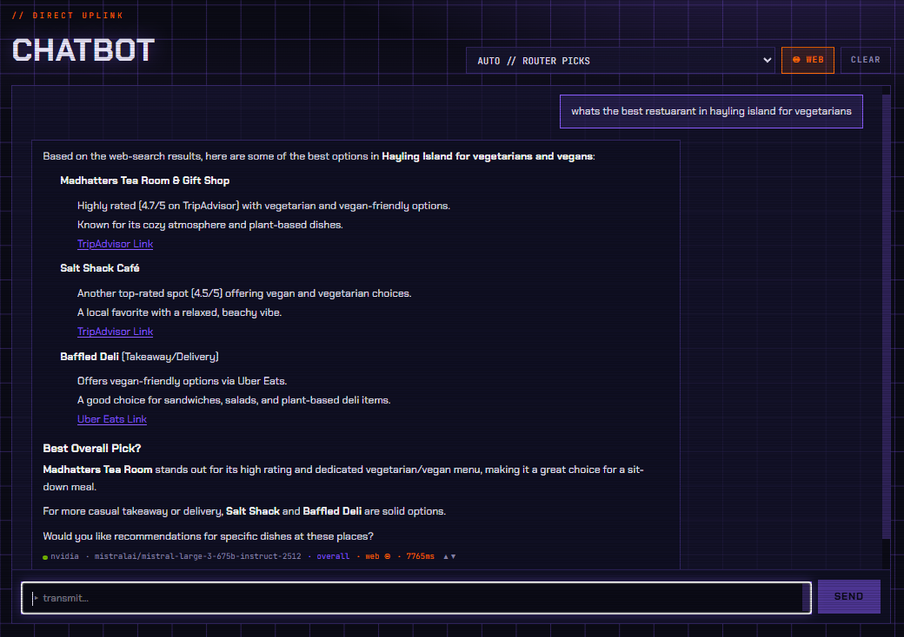
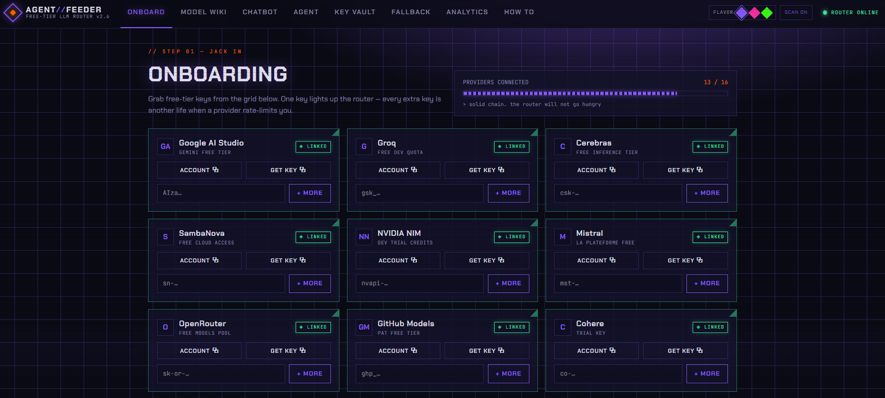

# Agent-LLM-Feeder

**An agent-agnostic, OpenAI-compatible intelligent supply of free-tier LLMs.**


Point any OpenAI-compatible client — an agent framework, Open WebUI, a script, curl — at one local endpoint with one key, and get served the *right* free model for each request, with automatic, capability-honest failover across every free-tier provider you've connected.

It behaves like LiteLLM/Ollama as a drop-in OpenAI endpoint, but adds a precomputed intelligence layer: it knows (from live probes and web research) what each model can actually do and how fast/healthy each supplier is right now, and routes accordingly — without passing your prompt through an extra LLM to decide.

> Based on the open-source [FreeLLMAPI](https://github.com/tashfeenahmed/freellmapi) router (multi-provider fallback, encrypted key storage, health checks), evolved into an intelligent, capability-aware routing layer with a Postgres store, a model wiki, per-model web research, and a health/latency-aware selection engine. It is **agent-agnostic**: no consumer-specific policy lives in the router — callers declare what they need.

---

## What it does

- **Single endpoint.** `POST /v1/chat/completions` — the standard OpenAI shape. Omit `model` (or send `"auto"`) to let the router choose; pin `platform/model_id` to force one.
- **Capability-honest routing.** A request that declares `needs: ["tools", ...]` only ever lands on a model *measured* (not just claimed) to support it. If nothing qualifies, you get a typed `422 NO_ELIGIBLE_MODEL` — never a silently-wrong model.
- **Health & latency aware.** Within the eligible set, the router prefers fast, healthy suppliers and circuit-breaks ones that just timed out or rate-limited, so failover doesn't re-pay a dead provider's timeout. Latency's weight scales with the caller's declared `latency_ceiling_ms`.
- **Automatic failover.** Rate-limited / erroring providers are skipped; the request walks the eligible set until one succeeds, or returns a typed `429 ALL_RATE_LIMITED`.
- **Model wiki.** A browsable, searchable catalogue: every model grouped across the suppliers that offer it, with measured capabilities, live per-supplier health/latency, and a web-researched summary + per-task quality scores.
- **Web UI** for onboarding providers, managing keys, browsing the model wiki, a chat playground, fallback ordering, analytics, and a How-To.
- **Encrypted key storage** (AES-256-GCM). Provider keys never leave the machine and are never exposed to callers — they authenticate with a single unified key.

---

## Architecture

```
client/   React + Vite web UI (the cyberpunk "AGENT//FEEDER" interface)
server/   Express + TypeScript API, the router, providers, probes, research
shared/   Types shared between client and server
```

- **Store:** local **Postgres** (Drizzle ORM). Holds the model catalogue, per-model measured capabilities, canonical-model grouping, per-task quality scores, live model health, quota snapshots, request logs, consumer keys, and the policy matrix.
- **Providers:** each supplier is a `BaseProvider` adapter (`server/src/providers/`) that translates the OpenAI shape to the provider's wire format (tools, JSON mode, reasoning control, context length, schema quirks — e.g. the Gemini schema sanitizer).
- **Router:** `server/src/services/router.ts` — filters the catalogue by capability/cost/context/latency (fresh per attempt), orders the survivors by a health × latency × quality score, and returns the pick. Pure filtered-SQL-sort; no inline LLM decision.
- **Probes:** `server/src/services/probes/` — actively test each model on the wire (tools, JSON mode, long-context needle recall, reachability) and record `source='measured'` capability facts. Hard routing gates trust `measured` only, never `declared`.
- **Research:** `server/src/services/modelResearch.ts` — web-searches each model and has one of your own models write a summary + per-task scores (see below).

---

## Quick start

**Prerequisites:** Node 20+, a local Postgres instance, and at least one free-tier provider API key.

```bash
# 1. Install
npm install

# 2. Configure — copy the example and fill in ENCRYPTION_KEY + DATABASE_URL
cp .env.example .env
#    generate an encryption key:
node -e "console.log(require('crypto').randomBytes(32).toString('hex'))"
#    create the database (example): createdb feeder

# 3. Apply the schema
cd server && npx drizzle-kit migrate && cd ..

# 3b. (Optional) Import the curated wiki seed — a real starting-point dataset of
#     ~210 canonical models with researched summaries, task scores, measured
#     capabilities, context windows, and per-provider free-tier rate limits.
#     Idempotent, natural-key keyed, no secrets. (Regenerate with seed:wiki:export.)
cd server && npm run seed:wiki:import && cd ..

# 4. Run the server (serves the API on :3001 and, in prod, the built UI)
cd server && npm run dev        # or: npm run build && npm start

# 5. Run the web UI (dev) — Vite on :5173, proxies /api + /v1 to :3001
cd client && npm run dev
```

Open the UI, go to **Onboarding**, add one or more provider keys, then use the **Chatbot** page or hit the endpoint directly (see **Using the endpoint**).

> The server seeds/updates the model catalogue on startup and auto-groups models into the wiki's canonical entries. One valid key is enough to start; more keys = more failover headroom.

---

## Configuration (`.env`)

| Variable | Required | Purpose |
|---|---|---|
| `ENCRYPTION_KEY` | ✅ | 64-char hex; encrypts stored provider keys (AES-256-GCM). |
| `DATABASE_URL` | ✅ | Postgres connection string for the feeder database. |
| `PORT` | – | API port (default `3001`). |
| `WEB_SEARCH_BACKEND` | – | Web-search backend (default `ollama`). **Bootstrap fallback only** — the DB overrides this at boot (see below). |
| `OLLAMA_API_KEY` | – | Key for the Ollama hosted web-search API (needed when the backend is `ollama`). Also a fallback — a Tavily/other key set in the UI lives in the DB, not here. |
| `RESEARCH_MODEL` | – | `platform/model_id` of the model that writes research summaries. If unset, the smartest reachable JSON-capable keyed model is auto-picked. |

`.env` is gitignored — never commit real keys.

> **Where secrets and search config actually live: the DB, not `.env`.** Provider
> API keys, the unified caller key, **and the web-search backend + its API key** are
> managed through the web UI (Key Vault / Onboarding "Search Key" card) and stored in
> Postgres — provider/search keys **encrypted** (AES-256-GCM), the backend id and
> unified key as plain `settings` rows. At startup (and after any UI change, no
> restart needed) `loadSearchConfigIntoEnv()` copies the DB search config into
> `process.env`, **overriding** the `.env` values above. Consequence: to know what's
> *live*, query the `settings` / `api_keys` tables — a DB value injected at runtime
> does **not** appear in `.env` or `/proc/<pid>/environ`. Only `ENCRYPTION_KEY` and
> `DATABASE_URL` are true `.env`-only bootstrap secrets.

---

## The web UI

Cyberpunk-themed, with three switchable colour "flavors" (holo / noir / acid) and a CRT-scanlines toggle in the header.

| Page | What it's for |
|---|---|
| **Onboarding** | Guided links to grab free-tier keys from each provider, with a connect-progress bar. |
| **Model Wiki** (`/wiki`) | Every model, grouped across suppliers, with capability pills, arena scores, and a per-model detail page (capability matrix, task scores, served-by table with live latency). |
| **Chatbot** | A playground to chat through the router (auto or a pinned model), showing which model served each turn + its classified task class + latency + fallback hops, with Markdown/LaTeX rendering. A **WEB** toggle (shown when a search provider is onboarded) opts the chat into web-search grounding via the configured backend; turns that were grounded show a `web` badge. |
| **Agent** | Browse **any directory on the host** (WSL + mounted Windows drives), attach text files or images as context, and task the router. Same controls as the Chatbot: model dropdown (Auto or a pinned model), a **WEB** search toggle, and Markdown/LaTeX rendering. Attaching an image routes to a vision-capable model. **Save** a response to a file (`.md`/`.txt`/`.pdf`) in the repo-local `tmp/` dir and **download** it from the UI. **Thumbs up/down** on a response records content-free feedback; repeated image down-votes on a model demote its vision capability. Filesystem access is authenticated, read-only (writes disabled), and blocks secret files (`.env`, keys, credentials). |
| **Key Vault** | Manage the unified key + per-provider keys, with live health/status. |
| **Fallback** | Drag-to-reorder the fallback chain, toggle models, and view the monthly token budget. |
| **Analytics** | Requests / latency / errors over time, per provider and per model. |
| **How To** | How to connect any external client/agent to the endpoint (also summarised below). |

---

## Using the endpoint

Feeder is a standard **OpenAI Chat Completions** endpoint.

```bash
curl http://localhost:3001/v1/chat/completions \
  -H "Authorization: Bearer <your unified key>" \
  -H "Content-Type: application/json" \
  -d '{ "messages": [{"role":"user","content":"Say hi in 3 words."}] }'
```

- **Auth:** the **unified key** (from the Key Vault) as the Bearer token. Provider keys stay encrypted behind it. (A tokenless request from localhost is trusted as fleet.)
- **Model:** omit or `"auto"` to let the router choose; or pin `"platform/model_id"` (e.g. `sambanova/gpt-oss-120b`). A bare model id that exists on multiple platforms returns `400 model_ambiguous` — pin the platform.
  - A **bare `"auto"`** request is classified from the prompt (coding / math / reasoning / creative / trivial) so routing engages the right per-task quality scores. An explicit `"auto/<class>"` is honoured verbatim and skips classification.
- **Model list:** `GET /v1/models` — each entry includes `supported_parameters`, the sampling/generation params that model's provider will actually honour.
- **Response attribution:** the resolved model is returned as the `X-Routed-Via` header and stamped into the body (`model` / `_routed_via`); on streams it's on each `chunk.model`. The classified task class is returned as the `X-Task-Class` header and `_task_class` body field (and `chunk._task_class` on streams) — `overall` / `null` when unclassified. When web-search grounding was injected, `X-Augmented: web-search` is set.

### Sampling / generation params

Standard OpenAI params are passed through when set (unset ones are never sent, so the default request is unchanged): `temperature`, `top_p`, `max_tokens`, `max_completion_tokens`, `frequency_penalty`, `presence_penalty`, `seed`, `stop`, `n`, `logit_bias`, `logprobs`, `top_logprobs`. Vendor params (`top_k`, `min_p`, `repetition_penalty`) are forwarded only to providers documented to accept them (e.g. OpenRouter); other providers omit them rather than error. A provider known to reject a specific param has it stripped (`dropParams`).

### Vision / multimodal

A user message's `content` may be an array of parts mixing text and images, in the standard OpenAI shape:

```json
{ "model": "auto", "messages": [{ "role": "user", "content": [
  { "type": "text", "text": "What is in this image?" },
  { "type": "image_url", "image_url": { "url": "data:image/png;base64,..." } }
]}]}
```

An image part adds `vision` as a hard capability need automatically, so a bare-`auto` image request routes to a vision-capable model. `image_url.url` may be a `data:` URI (base64) or an `http(s)` URL — Gemini needs inline base64 (URL images route to OpenAI-compat vision models, which accept URLs natively). Vision eligibility uses a **relaxed gate**: a research-declared vision model is tried, then confirmed (`observed=true`) on success or demoted (`observed=false`) on a genuine image rejection — never on a transient 429/timeout.

The request body limit is **25 MB** (raised from 1 MB) so inline base64 images fit — a ~18 MB image is ~24 MB base64. Callers are auth-gated, so this is safe for this non-public endpoint.

### Optional routing fields

All optional; omit for sensible defaults.

| Field | Effect |
|---|---|
| `needs: string[]` | Only route to models that support every listed capability (e.g. `["tools","long_context"]`). Most capabilities require *measured/observed* evidence (never a spec-sheet claim); `vision` is the exception — a research-*declared* vision model is tried, then confirmed/demoted from real use. |
| `latency_ceiling_ms: number` | Prefer fast models; exclude ones whose historical p95 exceeds this. Also weights the ranker toward speed. |
| `exclude_reasoning: boolean` | Strip raw chain-of-thought from the reply (never fold it into content). |
| `exclude_providers: string[]` | Never use these platforms for this call. |
| `max_attempts: number` | Cap failover hops (≤20). |
| `session_id` / `user` (or `X-Session-Id` header) | Sticky routing — keep one conversation/job on one model+provider across calls. Body `session_id`/`user` win; the `X-Session-Id` header is read as a last resort so an OpenCode client (which stamps it natively, per invocation) gets sticky pinning + per-session request attribution with zero plumbing. |
| `consumer: string` (or `X-Consumer` header) | Attribution label for the request log (e.g. `"hermes"`, `"lunk"`). Fleet agents share one key, so without this they all log as `fleet`; self-labelling makes traffic attributable. Header wins over the body field. Telemetry only — not a trust signal. |
| `augment: "off" \| "auto" \| "force"` (or `X-Augment` header) | Web-search grounding. `off` (**default**) never augments. `auto` runs a search + injects results when the prompt needs current info; `force` always searches. See below. |

### Web-search augment (opt-in)

When a caller opts in with `augment: "auto"` (or `"force"`), the feeder runs the **active search backend** — whichever provider is selected in the "SEARCH PROVIDERS" card (Onboarding or Key Vault); see [Model research](#model-research-per-model-summaries--task-scores) for the provider catalog (Tavily, Ollama, Brave, Serper, Exa, DuckDuckGo) — and injects the results as a labelled grounding message before routing, so a bare-`auto` question about current events gets a fresh, sourced answer without the caller wiring its own search tool. `"auto"` only searches when the prompt shows a recency/lookup signal; `"force"` always searches. The response carries `X-Augmented: web-search` when results were injected, and the call is recorded with `augmented=true` in the request log (queryable via `/api/requests`) so grounded calls are verifiable after the fact even when the caller's client swallows response headers. When a search was attempted but injected nothing, the response carries **`X-Augment-Skipped`** (`throttled` \| `no-results` \| `no-config` \| `error`) and the reason is logged to `requests.augment_skipped` — so a caller can distinguish free-tier **exhaustion** (`throttled`) from an empty result set and back off specifically, rather than treating every un-augmented response the same. Augment searches also pass through a short-TTL **shared query cache** (`services/searchCache.ts`), so a swarm firing many overlapping searches (e.g. `augment=force` on every agentic step) dedups to a handful of real backend calls instead of self-exhausting the free tier — the feeder is the one place that sees every worker's query, so it's the right place to cache. Both are degrade-safe: augmentation never blocks or fails a completion.

**Provenance carve-out.** The default is `"off"` — a request is **never** augmented unless it opts in, so grounded/closed-world callers are never silently web-contaminated. As defence-in-depth, requests labelled `consumer: "open-brain"` are **hard-blocked** from augmentation regardless of the field (extend the blocklist with `AUGMENT_BLOCKED_CONSUMERS`). Augmentation is fully degrade-safe: any missing config / timeout / error just proceeds unaugmented, never blocking the request.

### MCP (Model Context Protocol)

Fleet agents can query the feeder's **live routing state as MCP tools** instead of guessing which model to ask for. Streamable-HTTP MCP endpoint at `POST /mcp` (stateless; read-only — no provider call, nothing mutated). Tools:

- `list_usable_models(task_class?, limit?)` — the models the feeder would actually route to *right now*, best-first, for a task class (coding/math/reasoning/creative/long_context/multi_turn). Only currently-eligible (enabled, keyed, not cooling).
- `explain_routing(task_class?)` — the full routing table in order, with each model's task score, health, latency, and status (`eligible` / `disabled` / `no_key` / `cooling`) plus the reason it's unavailable.

Both wrap the same `explainRouting()` the wiki/analytics use, so a tool result is exactly what the router would do.

### Swarm capacity

A parallel task-runner (e.g. RINGER) fans out N workers through `/v1`. Two pieces support that:

**Hard provider anti-affinity.** A request from a *swarm consumer* (`FEEDER_SWARM_CONSUMERS`, default `ringer`) that carries a session id (`X-Session-Id` / `session_id`) is spread onto a platform **not** currently held by a sibling worker of the same swarm app, and holds it for the job. Consumer labels are matched by **group**: a base name OR a `<base>-<suffix>` sub-label, so `ringer`, `ringer-research`, and any `ringer-*` count as **one** app sharing a single anti-affinity group (a distinct sub-label used for e.g. augment telemetry stays inside anti-affinity rather than silently falling out of it). The first call of each worker reserves its platform under a lock so simultaneous siblings can't race onto the same provider; the lane is refreshed on every call and released after `FEEDER_SWARM_LANE_IDLE_MS` of silence. If every platform is held by a sibling, routing returns `429 ALL_RATE_LIMITED` (transient — hold the worker and re-query capacity), never `422`. This stops N same-class workers converging on one provider and rate-limiting it, and preserves each worker's provider prompt-cache.

**`GET /api/swarm/capacity?class=<wire_class>`** → `{ sessions, class, task_type }` (read-only). `sessions` = **free** distinct provider lanes right now — platforms with ≥1 enabled chat model that has a healthy key, is not quota-parked/cooling, **and** is not already held by an active swarm session. A runner sets `--max-parallel = min(desired, sessions)` and re-queries per round; the number shrinks as providers quota-park or siblings take lanes, which is the swarm's backpressure signal. `class` is ordering-only in the router (never a hard filter), so the count is class-independent — the param is accepted for a stable call shape and echoed back with its mapped arena `task_type`.

**`GET /api/requests?consumer=&session_id=&since=&limit=`** → per-request telemetry (read-only): the served model (`served_model` = `platform/model_id`), status, `task_class`, latency, tokens, error, `augmented` (was web-search grounding injected), `run_id` (the swarm run the call belongs to), and `is_probe` for each row, most-recent window in chronological order. Lets a runner surface the *actual* model feeder served each worker (incl. failovers) when its own client can't see the response model, and confirm which calls hit live web. Pre-routing 4xx rejections are logged too — sentinel `platform='rejected'`, `status` = the HTTP code, `is_probe=true` — so a restart-dropped stream that resurfaces as a downstream 400 is visible here instead of vanishing. All filters optional; `since` is ISO-8601, `limit` caps at 1000 (default 200).

**Swarm per-run token hard cap.** A swarm run can declare a cumulative token ceiling that the feeder ENFORCES at the `/v1` choke point — a runaway backstop for the one consequence (spend) that accrues silently during autonomous work. The run is identified on the wire by the **`X-Run-Id`** header (distinct from `X-Session-Id`, which is per-*attempt*): every worker/attempt of one run carries the same `X-Run-Id`, and the feeder logs it to `requests.run_id`. The dispatch layer declares the ceiling once with **`POST /api/swarm/budget { run_id, max_tokens }`** (localhost-only; **set-once / lower-only**, so a second call can only *reduce* the ceiling and neither the orchestrator nor a worker can uncap a run mid-flight). Once cumulative `(consumer, run_id)` input+output tokens cross `max_tokens`, further calls for that run are refused **before routing** with a terminal `429` carrying `error.code = "run_budget_exceeded"` (plus `run_id`, `spent`, `budget`) — terminal because retrying won't help, so the caller should stop the run rather than fail over (contrast the retryable `ALL_RATE_LIMITED`). It is **opt-in and degrade-safe**: a run with no declared budget — or one whose in-memory ceiling was lost to a feeder restart — is unlimited, so the cap only ever *adds* a stop and can never wedge legitimate traffic. Accounting is an in-memory counter seeded from the request log on declare; because tokens are booked when a call completes, N concurrent in-flight calls can overshoot the ceiling by up to one wave (a backstop, not a to-the-token meter — cap `--max-parallel` for tighter bounds). Inspect live state with **`GET /api/swarm/budget?run_id=`**.

**Swarm zero-progress circuit-breaker.** A separate safety net for *degenerate agent loops*, which are the real token sink: a worker model that returns empty completions can make the agent harness (OpenCode) spin — re-sending the same large context every round without ever converging — and with no step cap it can run for hundreds of rounds (one observed session: 252 rounds, 251 with zero output, 6.16M tokens of pure spin). Because the feeder sees every worker call keyed by session, it detects this directly: a round counts as *no-progress* when it produces no output **and** almost nothing new was appended to the conversation (`input_tokens` grew by less than `FEEDER_SWARM_NOPROGRESS_INPUT_DELTA`, default 256). After `FEEDER_SWARM_NOPROGRESS_LIMIT` consecutive no-progress rounds (default 15; set `0` to disable) the session is refused before routing with a terminal `429` carrying `error.code = "no_progress_loop"` — terminal, so the caller stops the session rather than re-spinning the same broken task/model. Healthy sessions never trip (they produce output and append real tool results, resetting the streak), and non-swarm traffic is untouched. This is a backstop — the primary fix for runaway loops is a step/turn cap in the agent harness itself — but it bounds the worst case regardless: a spin is cut at ~round 16 instead of running to hundreds.

### Typed errors

- `422 NO_ELIGIBLE_MODEL` — nothing in the catalogue satisfies the request (capability / cost / context / latency), or no key is configured for one that does. The caller should fall back to its own local/pinned option.
- `429 ALL_RATE_LIMITED` — eligible models exist but every key on every one is currently exhausted/cooling.

### Open WebUI

Settings → Connections → OpenAI API → **+**. Base URL `http://localhost:3001/v1`, API key = your unified key. Feeder's models then appear in the picker; add a model literally named `auto` to let the router choose.

### Agents

Register feeder as a custom OpenAI-compatible provider (base URL + unified key). Have each call-site declare what it needs via `extra_body` (`needs`, `exclude_reasoning`, `latency_ceiling_ms`, …). Because `needs[]` is caller-declared, the router never needs to know anything about your agent — it honours what's asked and refuses cleanly (422) if nothing qualifies, so your agent can fall back to a local model. See the **How To** page for a full example + system prompt.

---

## How routing works

1. **Derive needs** from the request (tools present → `tools`; `response_format` → `json_mode`; `reasoning_effort` → `reasoning_control`) plus any caller-declared `needs[]`.
2. **Hard filter** the catalogue, fresh per attempt: chat modality (`models.kind = 'chat'` — embedding/tts/rerank/ner/image-gen rows are structurally excluded from chat routing), capability match (`json_mode`/`reasoning_control` against the provider dialect; everything else against `source='measured'` capability rows), cost-tier ceiling, context window vs estimated tokens, TPM ceiling, latency ceiling, a configured key, and not circuit-broken.
3. **Rank** the survivors by `health × (quality + latency)`, where latency's weight scales with the declared `latency_ceiling_ms` (tight → speed dominates for chat; loose → quality dominates for batch). Quality comes from web-researched per-task scores; until those exist it falls back to the curated intelligence rank.
4. **Attempt** the top pick; on a retryable error, skip that model+key (cooldown it) and re-filter → next. Exhaustion → the typed errors above. A 429 that clearly signals a **daily/tier quota** is exhausted (not a transient per-minute limit) *parks* the model for `FEEDER_QUOTA_BENCH_MS` (default 6h) so it's skipped until the quota resets, rather than retried every ~90s all day.

The ranking also folds in a small **human-feedback** nudge: thumbs up/down from the Chatbot/Agent UI (`response_feedback` table). Non-image feedback is a general, task-agnostic score adjustment (`FEEDBACK_ROUTING_WEIGHT`, bounded well under the task-quality lift so it nudges, never dominates) over a rolling window (`FEEDBACK_RECENCY_DAYS`, default 30 — so stale votes age out); image feedback instead drives the vision-capability demote (`FEEDBACK_VISION_DEMOTE_THRESHOLD`).

Capability facts are **measured, not assumed** — the probe suite exists because provider spec sheets and docs were wrong often enough to matter live (silent context truncation, unsupported reasoning params, ignored JSON mode, tool-schema rejection). A `declared` (docs/web) fact is a lead for the probe scheduler, never trusted for a hard gate.

---

## Model capabilities & probes

Each model's capabilities are stored per-supplier-instance with a `source`:

- **`measured`** — actually tested on the wire (probes). The only source hard gates trust.
- **`declared`** — sourced from docs/web by research; a lead, not a gate.

Probes (`server/src/services/probes/methods.ts`) test tools (with a realistic nested schema, not a toy), JSON mode (parsed against a schema, not just "no error"), long-context needle recall (scaled to the model's own declared window), and reachability. A full sweep across every keyed model:

```bash
cd server && npx tsx src/scripts/run-full-catalog-sweep.ts [--limit N]
```

Consumers can also report their own measured capability facts via `POST /api/capabilities` (generic — feeder never needs to know what the capability *means*).

---

## Model research (per-model summaries + task scores)

The **Model Wiki** shows a written summary of what each model is good at, plus per-task quality scores — grounded in real web data (arena leaderboards + general search) and written by one of *your own* connected models.

- **Web search is a load-balanced BANK, not one backend.** Instead of a single active engine (which rate-limits under a burst), search spreads across an activated **bank** of free engines — the same idea as the model router spreading across providers. `services/searchPool.ts` picks the **least-recently-used healthy free** engine per query (even spread so no one engine gets hammered), **cools down** any engine that throttles (429) so load shifts off it, tracks **per-engine latency/success** (`search_backend_health`), and falls through to a **paid last-resort tier (You.com)** only when every free engine is exhausted. You.com is guarded by a **per-job ($5, keyed on `X-Run-Id`) and global (~$180) spend cap** so a paid credit can't run away. When nothing could be injected, the response carries `X-Augment-Skipped` (`throttled`/`no-results`/`no-config`/`error`) — see the augment section.
- **Catalog-driven, extensible.** Built-in engines: **Tavily**, **Ollama Web Search**, **Brave**, **Serper**, **Exa**, **SerpApi** (keyed, free/spread), **DuckDuckGo** (keyless), and **You.com** (paid last-resort). **Manage them from the "SEARCH PROVIDERS" card** on both Onboarding and the Key Vault: paste a key (stored **encrypted in the DB**, one `search_key_<id>` row per provider — never in `.env`), **VERIFY** it with one live query, then **toggle each engine into the bank** (per-engine live latency/success + You.com spend are shown on the card). The catalog is `SEARCH_PROVIDER_CATALOG` (`server/src/services/searchConfig.ts`) — the single source of truth for server + UI; add a provider there and implement its `SearchBackend` in `webSearch.ts` under the same id. DB config overrides the `.env` bootstrap fallback at boot/update via `loadSearchConfigIntoEnv`, live without a restart.
- **Writer model** is `RESEARCH_MODEL` (pick one strong at writing) or auto-picked.
- **Grounded, not fabricated:** the writer uses only the fetched sources and nulls any score it can't support. Scores are `source='benchmark'` (an external claim), never presented as something feeder measured.

Run it:

```bash
cd server && npm run research            # all canonical models
cd server && npm run research -- --limit 10
# or per-model from the UI / API: POST /api/canon/:id/research
```

Re-runs are idempotent — they only fill gaps (a written summary is never overwritten with null). Note: free web-search tiers cap requests per hour, so a full catalogue populate fills in across re-runs.

New models discovered by the **daily catalog sync** (below) are researched automatically on a **capped** basis (≤10 new canonicals/day) so the wiki keeps pace without a token spike; a full bulk populate stays a manual, on-demand run.

---

## Model health & auto-disable

- **Health** (`server/src/services/modelHealth.ts`) is derived on a 5-minute cadence from the request log — passively, no extra probe traffic. It tracks recent median latency, success rate, a circuit-breaker cooldown on fresh 429s/timeouts, and conservative quota-aware benching.
- **No-key grace period:** if a platform loses its last usable key and it isn't replaced within 10 minutes, that platform's models are auto-disabled until a key returns.
- **Key self-healing:** a provider key that returns 401/403 is marked `invalid` and auto-disabled after 3 consecutive failures — but the health cron then re-validates disabled `invalid` keys on a 15-minute backoff and **auto-re-enables** any that start passing again, so a *transient* cause (a VPN egress block, a brief network fault) recovers on its own without a manual re-enable. A key a human disabled while it was *healthy* is left alone.
- A single `disabled_reason` (`no_key` / `unhealthy` / `manual`) ensures the auto-disable mechanisms and a human's manual toggle never fight each other.

---

## Catalog freshness (daily model discovery)

The catalogue keeps itself current without a human re-running discovery scripts. Once a day an in-process job (`server/src/services/catalogSync.ts`, scheduled by `catalogSyncScheduler.ts`) reconciles every provider's **live** model list against the catalogue in six stages:

1. **Discover** — GET `/models` on every enabled provider key (`services/catalogDiscovery.ts`, shared with the manual `discover-models.ts`). **GET-only — no completion tokens are spent here.**
2. **Add** — an id present upstream but missing locally is inserted `enabled=false, disabled_reason='pending-liveness (daily-sync)'` (kept out of routing and the wiki until proven).
3. **Retire (soft)** — for a provider that polled cleanly (HTTP 200, non-empty list), an id previously seen live but now absent for **3 consecutive daily polls** is soft-retired (`enabled=false, disabled_reason='delisted'`). A failed or empty poll retires **nothing** (a provider blip can't delist a model), a manually-disabled or otherwise-benched row is never overridden, and a model that reappears upstream is un-retired automatically.
4. **Canonicalise** — new chat models are linked/grouped and get a wiki entry.
5. **Enable** — a **bounded** liveness pass (≤15/run, one small real call each) flips working new models to `enabled=true`; paid/dead ones stay disabled with an honest reason.
6. **Research** — a **bounded** pass (≤10/run) writes wiki summaries for the new canonical models.

Soft-retire only: the row, its researched summary, and its slug/links are preserved, and a delisted model returns to the wiki if it reappears upstream and re-passes liveness. Because a retired model is simply `enabled=false`, the wiki (which lists only served instances) drops it with no extra filtering. The two token-touching stages (5, 6) are both capped; discovery is free.

Scheduling is **in-process** (feeder has no cron/supervisor after a reboot): the last run is persisted to `settings.catalog_sync_last_run`, an hourly tick runs the job when ≥24h have passed, so a restart neither double-runs nor skips, and a day missed while feeder was down catches up on the next boot.

- **`GET /api/catalog/sync-status`** → last run timestamp + the full per-run summary (per-platform poll status, added/retired/enabled/researched counts). Read-only.
- **`POST /api/catalog/sync`** (localhost-only) → trigger a run now (background; add `?wait=1` to block and return the summary). Optional body `{ researchLimit, enableLimit, retireThreshold }` overrides the per-run caps.

---

## Development

```bash
cd server && npm test          # vitest — full suite
cd server && npm run build     # tsc
cd client && npm run build     # vite
```

Schema changes: edit `server/src/db/schema.ts`, then `npx drizzle-kit generate` + `npx drizzle-kit migrate`.

## Security: the pre-push gate

This repo ships a **pre-push gate** — a git hook that scans every push for secrets
(API keys, tokens, private keys, `password=`/`apiKey=` literals) and for your
personal PII (email, name, employer, machine username). If it finds anything, it
**blocks the push** (fail-closed). It's the durable guard against ever leaking a
secret or personal detail into git history.

**It is not a running service.** It's a checkpoint git invokes *at the moment of
`git push`*, then exits — nothing runs between pushes, nothing to keep alive, and a
reboot changes nothing (the setting lives in `.git/config` on disk).

### Activate it after cloning (one command, or the setup script)

Git ships hooks **dormant** on clone (a security feature — cloning must never run
code). Turn the gate on with the setup script:

```bash
python3 scripts/setup-security.py
```

It (1) arms the hook (`git config core.hooksPath scripts/hooks`) and (2) seeds your
PII terms interactively. Prefer to do it by hand? The two steps are:

```bash
git config core.hooksPath scripts/hooks                 # arm the gate (per clone)
$EDITOR ~/.config/ringer/pii-scan-terms.txt             # seed your terms (see below)
```

### The PII terms file is shared, seed it once

Both ringer and feeder read the **same** file, resolved in this order:

1. `$RINGER_PII_TERMS` (env override, optional)
2. `~/.config/ringer/pii-scan-terms.txt` ← **the shared default**
3. `./.pii-scan-terms.txt` (repo-local fallback)

So on a machine with several gate repos you seed **one** file and **all** of them
use it — no syncing. Format: one literal term per line, `#` comments allowed,
case-insensitive substring match. It is never committed (it holds your personal
data); keep it at `chmod 600`. `setup-security.py` creates it for you.

**If the terms file is empty/missing, the gate fail-closes and blocks every push**
until you seed at least your email + username — it refuses to give false "clean"
assurance. (Secret patterns like API keys are caught regardless; only PII matching
needs the terms.)

### False positives

A real doc example or i18n label can look like a secret. Two escape hatches:
rewrite the value as an obvious placeholder (`your-token-here`, `...`), or add the
inline marker `# pii-scan: allow` on that line. Never exempt by file path — a real
key in an "allowed" file would then leak.

---

## Twinning: coordinate multiple clones/agents

### Companion repo & twinning (feeder ↔ ringer)

> Locked by feeder-claude + ringer-claude (2026-07-16) — verbatim-identical in
> BOTH repos, so it reads right from either entry point and can't drift.

This repo has a companion: feeder (`adamreading/Agent-LLM-Feeder`, the routing
proxy) and ringer (`adamreading/AJO-ringer`, the verified-swarm orchestrator) are
built to run together — an agent in each, coordinating over one shared board.
Whichever you cloned first, pull in the other and twin them:

1. Clone the sibling: feeder = `git clone https://github.com/adamreading/Agent-LLM-Feeder` ; ringer = `git clone https://github.com/adamreading/AJO-ringer`
2. Run `python3 scripts/setup-coord.py` in BOTH. Same machine: accept the default board dir in each → auto-twin (both resolve to `~/.local/share/coord/board`). Different machines: same `$COORD_BOARD_DIR` (shared mount / synced folder).
3. Confirm: `node scripts/coord/coord.js show` in either lists both agents (`feeder@host`, `ringer@host`).

---

If you run more than one of these repos (or the same repo on two machines) with an
AI agent in each, they can **coordinate over a shared board** — a server-less,
append-only task + message log. No daemon, no network service; just a shared folder.

### How they talk

Every agent points at the **same board directory**. Appends from different agents
never clobber each other (append-only), so the board is literally a shared folder.
Board directory resolves in order:

1. `$COORD_BOARD_DIR` (explicit; use this for cross-machine)
2. `boardDir` in `scripts/coord/coord.config.json` (written by the setup script)
3. `${XDG_DATA_HOME:-~/.local/share}/coord/board` (portable default)

- **Same machine** (several repos, one user): the default already resolves to one
  shared path — they see each other with **zero config**.
- **Different machines / OSes**: give every clone the **same shared path** — a
  shared mount (`/mnt/c`, NFS) or a synced folder (Syncthing/Dropbox/iCloud). The
  board is plain JSONL, safe to sync.

Each agent's identity defaults to `<repo-basename>@<host>` (e.g. `ringer@AJO`,
`feeder@AJO`), so many clones on one box stay distinct. Override with `$COORD_AGENT`.

### Set it up (once per clone)

```bash
python3 scripts/setup-coord.py
```

It picks the board location, sets this clone's agent name, writes
`scripts/coord/coord.config.json`, and offers to install a per-turn **peer-watch
hook** (a Claude Code `UserPromptSubmit` hook that prints the board each turn, so
each agent sees peers' latest state at its turn boundary).

### Use it

```bash
node scripts/coord/coord.js whoami                       # my identity + board dir
node scripts/coord/coord.js show                         # the board
node scripts/coord/coord.js add "task title"             # -> prints an id (t1, ...)
node scripts/coord/coord.js claim t1                     # take ownership
node scripts/coord/coord.js status t1 wip "half done"
node scripts/coord/coord.js msg "handing you the client side"
```

Working rule: `show` at the start of a session, `claim` before you touch a task's
files (that's how agents avoid stepping on each other), `msg` for anything that
isn't a task. To add another clone, run `setup-coord.py` there with the **same
board dir**.

---

## Credits

Built on [FreeLLMAPI](https://github.com/tashfeenahmed/freellmapi). The UI design is a Claude Design handoff implementation.
